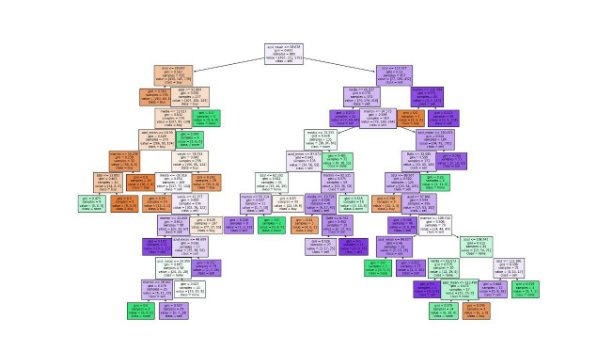
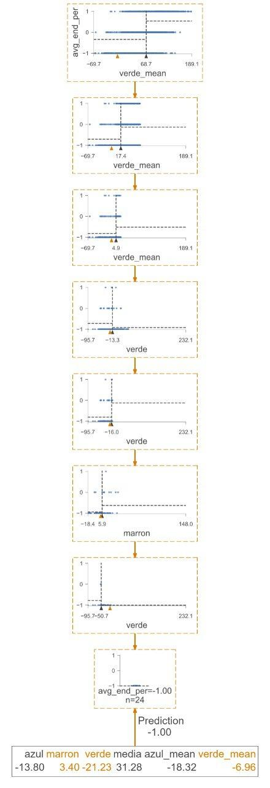

_**SEE ALSO**_ [Machine Learning Deep Detection]([https://github.com/Leci37/Strategy-stock-Random-Forest-ML-sklearn-TraderView/tree/main](https://github.com/Leci37/TensorFlow-stocks-prediction-Machine-learning-RealTime))

 #### Objetive:

Obtain N **_trading strategies_** with technical patterns with **Random Forest** python-sklearn, one strategy per action, be able to generate N strategies for each action.
Only candles with **_1 day_** format

For example, this strategy has been generated by ML, with *stock\_strategy\_random\_forest\_sklearn* @Leci37 also generates the _Pine Script™ v5_ code for use in TraderView https://es.tradingview.com/chart/?symbol=NYSE%3AALL (stock ex: Allstate Corporation) here.
[ALL_d5_q0.22_id1204_.pine](ALL_d5_q0.22_id1204_.pine) 


For models with deep learning and more than 100 technical patterns are recommended [TensorFlow deep learning](https://github.com/Leci37/TensorFlow-stocks-prediction-Machine-learning-RealTime)

#### These strategies should also have:
Real time alert:

- Know point of buy
- StopLoss Location and StopLoss Updates
- Report closing and sale
  To see the alerts, some of them are shown in the account <https://twitter.com/Whale__Hunters> .

At the code level:

- Generate _Pine Script™ v5_ code for use in TraderView, example [AAPL_d5_q0.217_TraderView.pine](AAPL_d5_q0.217_TraderView.pine) 
- Easy implementation with auto trader API like Alpaca or deGiro (ask about it)
- Record of SL operations and updates. Example AAPL [d_result/stra_simulator/AAPL.csv](d_result/stra_simulator/AAPL.csv)
- Evaluate the quality of the strategy [d_result/history/AAPL.csv](d_result/history/AAPL.csv) with python
- Calculate the associated technical patterns (only the konkorde pattern `get_konkorde_params_GOOD(` will be used in this version)
- **Ground True** (Y_target the variable to predict), in this case **where to buy** and where to sell, simple, the candlesticks where there are gains greater than 1% (defined in the variable `PER_VALEU_CHANGE = 1`). You can see it in the method `get_GT_day_candle(df_kon)` and extra `rolling_buy_sell_val_BUY(df_ind)`


By default it works with these two stocks `stocks_list = ["AAPL", "SHIP"] `

Important: The RamdonForest Model will **return** a number between 0 and 2, with **2** being most secure buy and **0** being sell.
Telegram GROUP: https://t.me/+3oG6U_hp93I2M2Ix 

#### Execution:

Install requirements

`S_00_dowload_data_API_yahoo.py` Download the historical values of OLHLV with the Yahoo API (you can use others such as alpaca but since you work with daily values it is not necessary)

`S_01_train_and_tunner_.py`
Collect OLHLV data
Calculate desired **_technical patterns_** `get_konkorde_params()`.
Get the _**ground true**_ GT to predict `get_GT_day_candle()`.
Split the data `train_test_split`
To _**fine-tune**_ the input parameters to RamdonForest, you have to train it with multiple values with `dict_paramGrid_rf`
The results of all models are saved in `d_price/RF/AAPL_248.rfmodel` 
Some **_PineScrip_** is generated, to see it in traderview with the best models `d_price/pine_tree/AAPL_d5_q0.218_id2163_.pine`

`S_01b_train_deep_tunner_OPtional.py` the same as the previous point with more combinations in `dict_paramGrid_rf`

`S_02_RF_model_eval_and_save.py` takes the 20 best combinations from point `S_01` and reevaluates and trains them. RF models are saved in `d_price/RF/AAPL_.rfmodel`
A file is generated that brings together all the evaluations of all the actions `d_price/RF/aa_RF_full_eval.csv`, check the column **final\_score**

`S_03_strategy_simulator_past.py` The RF model gives us the buy points, but how do we adjust the SL when the operation should be completed? To answer these questions is the `Strategy_TW_class.Strategy.update()` code.
To collect the complete simulation history of the generated strategy, the files `d_result/stra_simulator` are used with the history of all the operations that this code would have performed. They can also be seen in trader view with the files` d_result/pine_TW/AAPL_d5_q0.218_id2163_pine.pine`

`S_04_rf_eval_Realtime.py` evaluate in real time and in the future, the operations in today's are recorded in `d_result/win_loss_today_2024_03_11.csv`. It is implementable with automatic traders API (for alpaca deGiro, etc. consult the author) there are certain alerts in <https://twitter.com/Whale__Hunters> .


##### Example pine script
Will return a number between 0 and 2, with **2 being most safe to buy** and **0 to be most safe to sell**:
```java
//@version=5
strategy("konk_AAPL_q0.199", overlay=true, margin_long=100, margin_short=100, pyramiding=5)
decision_tree_0(azul, marron, verde, media, azul_mean, verde_mean, marron_mean, verde_azul, verde_media, media_azul) =>
	var float ret = -1 // # DecisionTreeRegressor(criterion='poisson', max_depth=5, max_features=0.7,
	if( marron_mean <= 103.606 )
		if( azul_mean <= -0.193724 )
			if( verde <= -12.581 )
				if( marron_mean <= 37.7765 )
					if( azul <= 1.83462 )
						ret := 1.555556
					if( azul > 1.83462 )
						ret := 0.600000
				if( marron_mean > 37.7765 )
					ret := 0.250000
			if( verde > -12.581 )
				if( verde <= 33.8535 )
					if( marron <= 34.2398 )
						ret := 0.711538
					if( marron > 34.2398 )
						ret := 0.181818
				if( verde > 33.8535 )
					if( media_azul <= 35.982 )
						ret := 1.529412
					if( media_azul > 35.982 )
						ret := 0.921569
		if( azul_mean > -0.193724 )
			if( azul <= 40.1892 )
				if( media <= 52.4629 )
					if( marron_mean <= 44.048 )
						ret := 1.193396
					if( marron_mean > 44.048 )
						ret := 1.555556
				if( media > 52.4629 )
					if( media <= 63.4882 )
						ret := 0.827160
					if( media > 63.4882 )
						ret := 1.125551
			if( azul > 40.1892 )
				if( media_azul <= -23.329 )
					ret := 1.714286
				if( media_azul > -23.329 )
					if( media <= 60.413 )
						ret := 0.238095
					if( media > 60.413 )
						ret := 1.166667
	if( marron_mean > 103.606 )
		if( media_azul <= 65.3109 )
			ret := 0.666667
		if( media_azul > 65.3109 )
			if( verde_azul <= 110.687 )
				if( media <= 102.936 )
					if( verde_media <= 27.9566 )
						ret := 1.750000
					if( verde_media > 27.9566 )
						ret := 1.166667
				if( media > 102.936 )
					if( verde_mean <= 117.225 )
						ret := 1.000000
					if( verde_mean > 117.225 )
						ret := 1.473684
			if( verde_azul > 110.687 )
				if( verde_azul <= 115.788 )
					if( marron <= 111.401 )
						ret := 1.133333
					if( marron > 111.401 )
						ret := 0.142857
				if( verde_azul > 115.788 )
					if( marron <= 105.636 )
						ret := 1.866667
					if( marron > 105.636 )
						ret := 1.236220
	
    ret //return
```

Randon Forest visualization, final sheet is labeled: _buy, none, sell_




Why has Randon Forest made a decision?




You can view plot the model in a graph by **_uncommenting_**:
```python 
tree_to_code(rf_model.estimators_[0], rf_model.feature_names_in_)
r = export_text(rf_model.estimators_[0], feature_names=list(rf_model.feature_names_in_))
exported_text, sas_text, py_text, code_TVW= export_code(eval_model, 0, list(rf_model.feature_names_in_))
 ```

##### Notes:

- Be careful with the risk of **overfitting**, 4 or 5 branches at most are used `"max_depth": [4,5] `, the smallest possible are recommended.
- For **more technical indicators** in python you can find 200 here, look the funtion `extract_features(df: pd.DataFrame,extra_columns =False,  shift=150, debug=False)` inside https://github.com/Leci37/TensorFlow-stocks-prediction-Machine-learning-RealTime/blob/master/features_W3_old/v3.py some of the technical indicators take future data, be careful. 
- If you want to obtain the RF code in _**sas, TraderView**_ and _**python**_ see the function `exported_text, sas_text, py_text, code_TVW = export_code(rf_mod.estimators_[0], 0, list(rf_mod.feature_names_in_))`

[](https://www.buymeacoffee.com/leci37)


